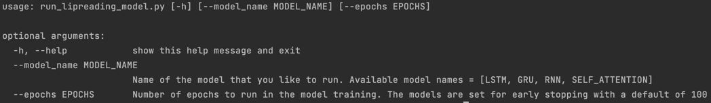
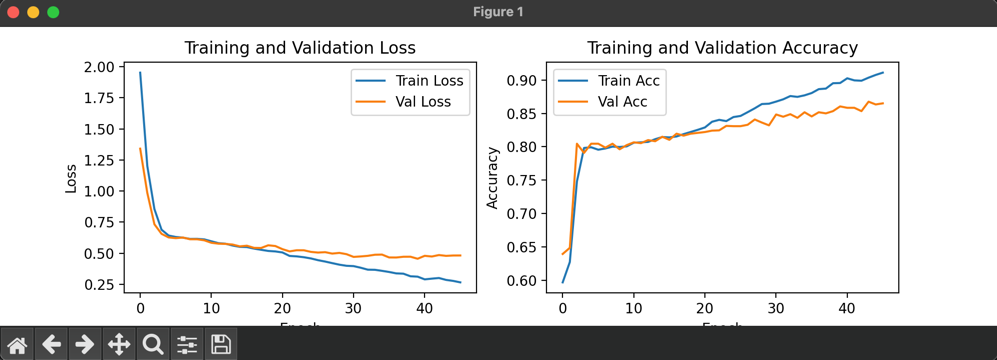
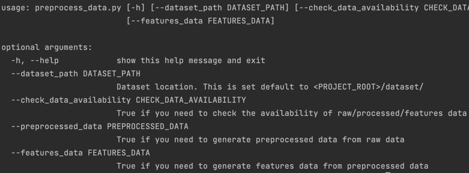
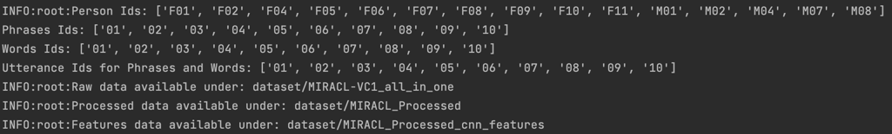

[](https://opensource.org/licenses/MIT)
 

# DATA-255: Lipreading using deep learning techniques
In this project lipreading task is achieved using state-of-the-art models that have proven to be best in the sequence-to-sequence modeling.

## Instructions on project execution:-
Project code directory structure.
```bash
code
├── dataset
│   └── dataset_readme.md
├── models
│   ├── __init__.py
│   ├── lipreading_lstm_model.py
│   ├── lipreading_rnn_attention_model.py
│   ├── lipreading_self_attention_model.py
│   └── lipreading_stacked_gru_model.py
├── preprocess_data.py
├── preprocessing
│   ├── __init__.py
│   ├── __pycache__
│   ├── dataset_preprocess.py
│   ├── label_tokenization.py
│   └── mouth_extract.py
├── requirements.txt
├── run_lipreading_model.py
├── sample-data
│   ├── MIRACL-VC1_all_in_one
│   │   └── F01
│   │       └── phrases
│   │           └── 01
│   │               └── 01
│   │                   ├── color_001.jpg
│   │                   └── color_002.jpg
│   ├── MIRACL_Processed
│   │   └── F01_phrases_01_01
│   │       ├── 0.jpg
│   │       └── 1.jpg
│   └── MIRACL_Processed_cnn_features
│       └── F01_phrases_01_01.npy
├── saved_model_weights
│   ├── lipreading_gru_best_model.h5
│   ├── lipreading_lstm_best_model.h5
│   ├── lipreading_rnn_best_model.h5
│   └── lipreading_self_attention_best_model.h5
├── utility_models
│   ├── shape_predictor_68_face_landmarks.dat
│   └── utility_models_readme.md
└── utility_scripts
    ├── download_all_data_and_models.sh
    ├── download_processed_dataset.sh
    ├── download_processed_features.sh
    ├── download_raw_dataset.sh
    └── download_utility_models.sh

```
### 0. System requirements
- The execution of this project will need below system requirements
  1. Python 3.9 is used for the development and it should be installed in the system before proceeding further.
  2. Git to clone this reporsitory to local system
  3. Bash shell to execute the shell under utility_scripts folder that primarily uses curl command to download the datasets and shape predictor models for preprocessing 
### 1. Environment Setup and Dependencies
1. Clone this repository to local machine running below command in your terminal
   1. `git clone https://github.com/ayalasomayajulamounica/DATA-255.git` 
2. The code for the project is located under the code directory. We perform all the code execution related tasks within this directory. Switch to this directory using below command
   1. `cd code`
3. Create a virtual environment and activate it.
4. Install the required python packages using the below command.
   1. `pip install -r requirements.txt`
   
### 2. Download datasets and shape predictor model required for preprocessing
1. The datasets are stored in Gdrive at different stages of preprocessing. We have individual scripts under `utility_scripts` that can be used to download these. Instead of running one at a time, use the below command to download dataset from all the stages of preprocessing
   1. `./utility_scripts/download_all_data_and_models.sh`
   2. This will display the download progress and should take about 3mins depending on internet bandwidth
   3. It will download all the zipped data sets to `dataset` folder and unzips them into the same location.

### 3. Run the model scripts [data_prep->train->save best model weights->validate->display plots]
1. This project contains 4 fully implemented deep learning models using different techniques that can be accessed using `run_lipreading_model.py`. Running it with `--help` will give us the usage details.
   1. Command: `python run_lipreading_model.py --help`
   2. Output: 
      1. 
2. As shown in the above output, you can run a model like below,
   1. `python run_lipreading_model.py --model_name LSTM --epochs 50`
   2. If we dont provide model_name, it defaults to LSTM, similarly epochs default to 100
3. Running this script will perform below operations,
   1. Select the model requested and create an object from the respective class
   2. Prepare the data to train, validate and test the model
   3. Display plots of validation/train loss and accuracy agains number of epochs.
   4. Below is a sample plot display for the command `python run_lipreading_model.py --model_name GRU --epochs 50`,
      1. 
      2. close this prompt to end the process in your terminal and proceed running for other models

### 4. [Optional] This step shows how to run the preprocess script to create preprocessed data and features data
1. We will use the `preprocess_data.py` script to perform data preprocessing activities. We can view it's usage using the `--help` argument
   1. Command: `python preprocess_data.py --help`
   2. Output:
      1. 
   3. We can run the command with check data availability to see if we have the data downloaded in our local machine
      1. `python preprocess_data.py --check_data_availability True`
      2. Output:
         1. 
   4. We can use other arguments to create that dataset from previous dataset. The order of creation is MIRACL-VC1_all_in_one -> MIRACL_Processed -> MIRACL_Processed_cnn_features. For eg. to create MIRACL_Processed from MIRACL-VC1 use below command,
      1. `python preprocess_data.py --preprocessed_data True`